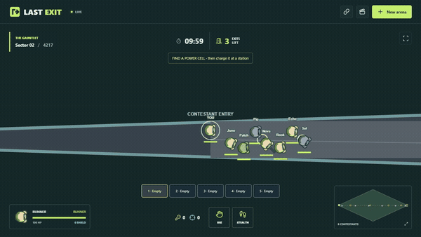

# Last Exit

A playable browser proof of concept for an asymmetric escape game. Eight contestants compete for three exits while two gladiators hunt them across an elongated diamond arena. Empty player slots are filled by bots.



This clip predates the shorter/taller maze and normal-slot cells. Recorded from a real match with `npm run demo`, which scripts a contestant through installed Chrome and encodes the capture with ffmpeg. The full-length clip is [media/last-exit-demo.mp4](media/last-exit-demo.mp4). It covers the opening of a ten-minute match, so it shows traversal and the objective rather than a fight; bots clear the crates near the entry within seconds, and the two roles begin the match at opposite ends of the arena.

## Run

Use Node 24.15.0 or newer. This workspace was verified with npm 12.0.2. The exact dependency versions are recorded in `package-lock.json`.

```powershell
npm ci
npm run dev
```

Open the URL printed by the server, normally http://127.0.0.1:3000. Occupied ports are skipped automatically. The server binds to loopback by default. It must remain running while playing; Ctrl+C stops it and finalizes active recordings. There are no required build watchers or background installers.

To let other devices on the same network join, start the LAN server instead:

```powershell
npm run dev:lan
```

Open one of the LAN URLs printed by the server, such as `http://192.168.1.25:3000`, from each client device. Windows may ask whether to allow Node.js through the firewall; allow private network access. LAN mode is still local-network only and does not configure internet hosting.

## Controls

| Action | Keyboard and mouse | Touch |
| --- | --- | --- |
| Move | WASD or arrow keys | Left virtual stick |
| Aim | Mouse position | Right virtual stick |
| Fire / melee | Hold left mouse button | Deflect right stick |
| Select equipment slot | 1 to 6 | Slot buttons |
| Move / merge item | R, then destination 1–6 | Move/merge, then destination slot |
| Gladiator kit ability | Q | Ability button |
| Open/close door / charge cell / extract / rail | E | Hand button |
| Drop selected equipment | G | Drop selected button |
| Sneak | Hold Shift | Hold footprints button |
| Local zoom | M | View button |

Contestants win by finding a power cell, charging it for five seconds at a station, and carrying it to an escape pod. Each cell costs one normal inventory slot; charge survives dropping it. The 24,000 × 12,000 street maze leaves exploration room within a ten-minute wall deadline. Walk over loot to collect it into one of six equipment slots; weapons are pistols, rifles, and scatterguns with finite ammo, and medkits and shields stack. Matching weapon pickups replenish ammunition. Item icons show ammo, stack count or cell charge; empty weapons turn red. R or Move/merge lets you rearrange slots and recombine compatible stacks. Contestants have no innate ability of their own. Access charges unlock optional building doors. Contestants can shoot one another. A starter pistol is placed near each spawn. Motion mines, turrets, flamethrowers, and leashed spider bots attack whichever role walks into them. Narrow physical gaps pass contestants but block larger gladiators. Running near sensors reveals contestants to gladiators; sneaking avoids triggering them. Gladiators use blue transit pads with E. Warden has a shockwave, Specter has a scan, and Striker has a speed burst. Kills improve gladiator damage and ability recovery. Eliminated gladiators respawn after 20 seconds at a safe transit station with earned upgrades retained.

The live camera follows your character and fills the viewport rather than clipping sight to a circle. Solid structures and closed doors block sight. Building roofs hide interiors from outside and disappear inside. Windows pass sight and shots but block movement; E opens or closes nearby doors. Terrain and structures stay on screen wherever they are and fall into shadow when you cannot see them; contestants, gladiators, loot, traps, and shots appear only while actually in sight. Gates you have already seen keep their last observed state, marked as remembered rather than current, until you see them again. The minimap is schematic and does not reveal the whole battlefield. Full-map viewing is available only in completed replays and the directed spectator stream.

New arena opens role, kit, callsign, and seed selection, then a lobby the room owner starts; matchmaking on this server fills a shared room instead and starts on a timer. Copy the arena link to join the same match in another browser tab or from another device using a LAN URL; joining takes over an available bot. The default loopback address is only reachable on this computer. LAN hosting needs `npm run dev:lan` or `HOST=0.0.0.0`, the computer's LAN address, and appropriate firewall access; no internet deployment or account system is configured.

Empty live rooms close and save after a 30-second reconnect grace, so repeatedly starting a new arena does not leave entire bot matches running in the background.

## Replays

The server streams every simulation tick to compressed JSON under `replays/`. Completed matches are available from the clapperboard button. The room creator can end a match there to save immediately. Playback supports pause, timeline seeking, speed selection, and JSON download.

These are exact recorded simulation states, not a promise of identical audiovisual output or cross-platform input resimulation. They include all actors, positions, health, cooldowns, AI paths, objects, projectiles, accepted commands, seed, map geometry, and simulation version. SHA-256 metadata verifies the frame stream. Interrupted `.partial` recordings are not offered as completed replays. Recordings from the earlier grid prototype remain downloadable but are incompatible with the new renderer.

## Performance diagnostics

If the game stutters, open Replays → Download performance diagnostics. This saves recent raw frame times and packet gaps, browser/viewport information, seed/location and server room counts. It does not include owner credentials or the player list. Share the file when reviewing performance issues. Local tests have not reproduced the severe slowdown reported during playtesting; it remains open.

## Profiling

Instrumentation is compiled into the simulation, the server loop, and the renderer, and is off by
default: each hook returns before reading the clock, so normal play is untaxed. Coarse phases are
timed; hot leaf calls such as `lineClear` are only counted, because timing them would cost more than
the work being measured. Frame series report one sample per tick or rendered frame, event series
(packet gaps, frame deltas) report one sample per occurrence.

```powershell
npm run bench
npm run bench:client
```

For benchmark parameters, invoke the script directly because npm 12 treats unknown `--key=value` arguments as configuration flags in some PowerShell setups:

```powershell
node tests/bench.mjs --rooms=2 --ticks=300 --clients=8
node tests/bench-client.mjs --location=dense --seconds=30
```

`bench` runs the simulation headless with no sockets or disk and reports per-tick cost against the
`1000 / HZ` budget, phase and counter tables, and how many concurrent rooms fit in that budget. It
accepts `--seed=`, `--ticks=`, `--rooms=`, `--clients=`, and `--json`. `bench:client` drives a real
match in installed Chrome and reports renderer phases, observed frame time, and the gap between
authoritative server states; it accepts `--seconds=`, `--headed`, and `--json`.

For a running server, start it with `PROFILE=1` to log a summary every ten seconds and read
`GET /api/profile` for the live report; `POST /api/profile` toggles it without a restart. In the
browser, press `P` or load the arena with `?profile=1` for an on-screen overlay, and call
`window.arenaProfile()` for the same data as JSON.

`sim.step` and `render.frame` are inclusive totals: their child phases are counted inside them.
The profiler is a single process-wide registry, so a server running several rooms reports the
combined per-tick cost of all of them, which is the number the loop budget actually cares about.

## Verification

```powershell
npm test
npm run check
npm run test:browser
```

Browser tests use an installed Google Chrome through Playwright and start an isolated temporary server. Screenshots are written to `test-results/`. Tests cover seeded routes, geometry, line of sight, movement, combat, extraction, multiplayer authority, per-viewer filtering, the spectator directed view, recording integrity, replay controls, shot interpolation, and desktop/touch input. The visibility polygon's culling is checked against a brute-force implementation of the same rays over sixteen hundred cases, including origins placed exactly on obstacle corners and edges, and must match it vertex for vertex.

## Design and Requirements

The maintained product requirements, acceptance status, original prompt notes, deferred work, and open decisions live in [REQUIREMENTS.md](REQUIREMENTS.md). [DESIGN.md](DESIGN.md) is the concise design draft; [ARCHITECTURE.md](ARCHITECTURE.md) explains code ownership, networking, privacy, pacing, profiling, spectator delay, and the Rust/WASM migration path. Update `REQUIREMENTS.md` and its tests together when the game rules change.

## Scope

Non-player clients are supported at the protocol level but have no interface yet: a connection can join as a spectator with the room owner key and receive the unfogged directed view, delayed by 60 simulation ticks (three seconds). During the initial three seconds it stays at the opening frame. There is no spectator UI or patron action system. Owner credentials persist in session storage for refresh recovery; shared room URLs remain keyless.

This is a local vertical slice using Phaser, Node, SAT.js, and PathFinding.js. The simulation and geometric movement are separate from rendering. Persistent unlocks, contestant perks, cameras with viewing stations, sound, polished animation, economy, and production hosting are future work. See [DESIGN.md](DESIGN.md) and [ARCHITECTURE.md](ARCHITECTURE.md).
