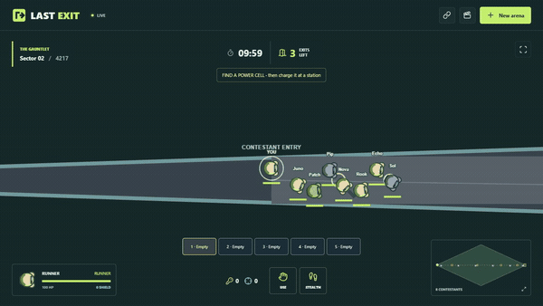

# Last Exit

A playable browser proof of concept for an asymmetric escape game. Eight contestants compete for three exits while three gladiators hunt them across an elongated diamond arena. Empty player slots are filled by bots.



This clip predates the shorter/taller maze and normal-slot cells. Recorded from a real match with `npm run demo`, which scripts a contestant through installed Chrome and encodes the capture with ffmpeg. The full-length clip is [media/last-exit-demo.mp4](media/last-exit-demo.mp4). It covers the opening of a ten-minute match, so it shows traversal and the objective rather than a fight; bots clear the crates near the entry within seconds, and the two roles begin the match at opposite ends of the arena.

## Run

Use Node 24.15.0 or newer. This workspace was verified with npm 12.0.2. The exact dependency versions are recorded in `package-lock.json`.

```powershell
npm ci
npm run dev
```

Open the URL printed by the server, normally http://127.0.0.1:3100. If that is busy the next free port up to 3109 is used. A `PORT` set in the environment or in an untracked `.env.local` beside `package.json` is used exactly, and the server stops if it is busy; `PORT=0` picks any free port. The server binds to loopback by default. It must remain running while playing; Ctrl+C stops it and finalizes active recordings. There are no required build watchers or background installers.

The shared simulation is written in TypeScript and is never compiled to an output directory. Node strips the types as it loads each module, and the dev server does the same for the browser as it serves them, so there is no bundle, no `dist/`, and no source map to keep in sync. Type checking is a separate command, not a step between editing a file and running it.

To let other devices on the same network join, start the LAN server instead:

```powershell
npm run dev:lan
```

Open one of the LAN URLs printed by the server, such as `http://192.168.1.25:3100`, from each client device. Windows may ask whether to allow Node.js through the firewall; allow private network access. LAN mode is still local-network only and does not configure internet hosting.

## Controls

For the full procedural pipeline, open `/generation-demo.html` on the address the dev server printed
([default](http://localhost:3100/generation-demo.html)). Step through Region, Decomposition, Generated and
Walk: the default example joins two populated room regions through a corridor.
Vary contents, seed and density, inspect child assignments, then walk with
WASD/arrows and open doors with E. This is a standalone development preview.

For the decomposition SDK, open `/decomposition-lab.html` on the address the dev server printed
([default](http://localhost:3100/decomposition-lab.html)). Compare candidate footprints, neck cuts, depth and
generator assignments, or use **Explore decomposition trees** to compare bounded
hierarchies. Choose an objective, depth and retained alternative, then select a
branch to inspect its descendants and stopping reason. Tree exploration is
structural; those hierarchies do not yet feed the physical generation demo.
The flat inspector below still lets you compare candidate footprints and
generator assignments; inspect residuals and change policy weights. Controls apply
automatically; try the Balanced and Prefer fewer pieces presets. Status explains
when settings change but the winning allocation stays the same. This is
separate from the walkable micro geometry preview. See [docs/19](docs/19-decomposition-design.md)
for the design and [20.4](docs/20.4-hierarchical-generation.md) for implemented limits.

For procedural architecture development, open `/micro-lab.html` on the address the dev server printed
(http://localhost:3100/micro-lab.html by default; an agent worktree uses its assigned port). Generate
open, depot, courtyard, ruin, or contestant-entry regions; choose live or cell
body proportions, inspect clearance and numbered entry positions, walk with WASD
as either role, use E at doors, and export or import a spec/validated result JSON.
The normal arena remains unchanged. CLI/custom-region usage and the macro contract
are in [20.5](docs/20.5-tools-and-next-boundaries.md) and
[20.1](docs/20.1-region-contract.md), respectively.

| Action | Keyboard and mouse | Touch |
| --- | --- | --- |
| Move | WASD or arrow keys | Left virtual stick |
| Aim | Mouse position | Right virtual stick |
| Fire / melee | Hold left mouse button | Deflect right stick |
| Select equipment slot | 1 to 6 | Slot buttons |
| Move / merge item | Drag between slots, or R then destination 1–6 | Drag between slots, or Move/merge then destination slot |
| Gladiator kit ability | Q | Ability button |
| Open/close door / charge cell / extract / rail | E | Hand button |
| Drop equipment | Drag a slot into the arena, or G for selected item | Drag a slot into the arena, or Drop selected button |
| Sneak | Hold Shift | Hold footprints button |
| Fullscreen | F | Fullscreen button |

Contestants win by finding a power cell, charging it for five seconds, and carrying it to the extraction site. Three shared slots are available. Live maps use the authored generation chain at 17,280 by 8,640 units, with a ten-minute wall deadline. Each start has a nearby pistol and uncharged cell. Walk over loot to collect it into six equipment slots; weapons have finite ammo, and medkits and shields stack. Use R or Move/merge to rearrange equipment. Contestants can shoot one another and have no innate ability. Gladiators use six distributed blue transit stations with E; Warden has a shockwave, Specter a scan, and Striker a speed burst. Kills improve gladiator damage and ability recovery. Eliminated gladiators respawn after 20 seconds at a safe transit station with earned upgrades retained. Current body sizes and combat tuning are preserved; narrow-gap balance still needs a pass. Traps, sensors and locked doors remain supported in legacy maps but are not authored by the live chain yet.

The live camera follows your character and fills the viewport rather than clipping sight to a circle. Solid structures and closed doors block sight. Building roofs hide interiors from outside and disappear inside. Windows pass sight and shots but block movement; E opens or closes nearby doors. Terrain and structures stay on screen wherever they are and fall into shadow when you cannot see them; contestants, gladiators, loot, traps, and shots appear only while actually in sight. Gates you have already seen keep their last observed state, marked as remembered rather than current, until you see them again. The minimap is schematic and does not reveal the whole battlefield. Full-map viewing is available only in completed replays, the directed spectator stream and the dev view.

New arena opens role, kit, callsign, and seed selection, then a lobby the room owner starts; matchmaking on this server fills a shared room instead and starts on a timer. Copy the arena link to join the same match in another browser tab or from another device using a LAN URL; joining takes over an available bot. The default loopback address is only reachable on this computer. LAN hosting needs `npm run dev:lan` or `HOST=0.0.0.0`, the computer's LAN address, and appropriate firewall access; no internet deployment or account system is configured.

### Dev view

Under `npm run dev` (and `dev:lan`) the telescope button in the top bar, or the backquote key, steps you out of your player into the match's dev view and back again; your player stays in the match, idle, meanwhile. It shows the whole live map, undelayed and unfogged. Drag or hold WASD/arrows to pan and use the wheel to zoom. Click a player or bot, or pick one from the list, to follow them in their own sight; V toggles that fog, Esc stops following, and 0 returns to the whole arena. T moves the followed player (or your own, while you have stepped out of it) to the point under the cursor, if they can stand there. The pause button or Space pauses the whole match for everyone in it (not other rooms); the replay shows a mark where it was paused. The same camera controls work in replays. `?room=<id>&dev` opens a standalone dev view in any tab. The server decides who may: `DEV_TOOLS=none|owner|all` (or `--dev-tools=`), unset meaning nobody.

Empty live rooms close and save after a 30-second reconnect grace, so repeatedly starting a new arena does not leave entire bot matches running in the background.

## Replays

The server records simulation ticks to compressed JSON under `replays/`. Completed matches are available from the clapperboard button. The room creator can end a match there to save immediately. Playback supports pause, timeline seeking, speed selection, and JSON download. Slow storage never pauses gameplay: bounded recording may omit frames, with recovered archives labelled incomplete. Playback preserves elapsed match time and indicates missing intervals. A permanent recording failure notifies viewers while the match continues.

These are exact recorded simulation states, not a promise of identical audiovisual output or cross-platform input resimulation. They include all actors, positions, health, cooldowns, AI paths, objects, projectiles, accepted commands, seed, map geometry, and simulation version. SHA-256 metadata verifies the frame stream. Interrupted `.partial` recordings are not offered as completed replays. Recordings from the earlier grid prototype remain downloadable but are incompatible with the new renderer.

## Performance diagnostics

If the game stutters, open Replays → Download performance diagnostics. This saves recent raw frame times and packet gaps, browser/viewport information, seed/location and server room counts. It does not include owner credentials or the player list. Share the file when reviewing performance issues. Local tests have not reproduced the severe slowdown reported during playtesting; it remains open.

## Profiling

Instrumentation is compiled into the simulation, the server loop, and the renderer, and is off by
default: each hook returns before reading the clock, so normal play is untaxed. Coarse phases are
timed; hot leaf calls such as `lineClear` are only counted, because timing them would cost more than
the work being measured. Frame series report one sample per tick or rendered frame, event series
(packet gaps, frame deltas) report one sample per occurrence.

```powershell
npm run bench
npm run bench:client
```

For benchmark parameters, invoke the script directly because npm 12 treats unknown `--key=value` arguments as configuration flags in some PowerShell setups:

```powershell
node tests/bench.mjs --rooms=2 --ticks=300 --clients=8
node tests/bench-client.mjs --location=dense --seconds=30
```

`bench` runs the simulation headless with no sockets or disk and reports per-tick cost against the
`1000 / HZ` budget, phase and counter tables, and how many concurrent rooms fit in that budget. It
accepts `--seed=`, `--ticks=`, `--rooms=`, `--clients=`, and `--json`. `bench:client` drives a real
match in installed Chrome and reports renderer phases, observed frame time, and the gap between
authoritative server states; it accepts `--seconds=`, `--headed`, and `--json`.

For a running server, start it with `PROFILE=1` to log a summary every ten seconds and read
`GET /api/profile` for the live report; `POST /api/profile` toggles it without a restart. In the
browser, press `P` or load the arena with `?profile=1` for an on-screen overlay, and call
`window.arenaProfile()` for the same data as JSON.

`sim.step` and `render.frame` are inclusive totals: their child phases are counted inside them.
The profiler is a single process-wide registry, so a server running several rooms reports the
combined per-tick cost of all of them, which is the number the loop budget actually cares about.

## Verification

```powershell
npm test          # fast tier, for iterating
npm run test:all  # adds the slow seed sweeps and whole-match runs
npm run check
npm run typecheck
npm run test:browser
```

`npm run check` parses every JavaScript module and confirms every TypeScript module erases cleanly, which is what Node does to load it. `npm run typecheck` is the stronger pass: `tsc --noEmit` over `shared/` under `strict`.

Browser tests use an installed Google Chrome through Playwright and start an isolated temporary server. Screenshots are written to `test-results/`. Tests cover seeded routes, geometry, line of sight, movement, combat, extraction, multiplayer authority, per-viewer filtering, the spectator directed view, the dev view's camera and follow, recording integrity, replay controls, shot interpolation, and desktop/touch input. The visibility polygon's culling is checked against a brute-force implementation of the same rays over sixteen hundred cases, including origins placed exactly on obstacle corners and edges, and must match it vertex for vertex.

## Design and Requirements

The maintained product requirements, acceptance status, original prompt notes, deferred work, and open decisions live in [docs/](docs/), split into numbered files so a task can load the two or three it needs. [docs/00-index.md](docs/00-index.md) says what is where: `1x` is product, `2x` is engineering, `3x` is process, `4x` is plan and history. Update the relevant numbered file and its tests together when the game rules change.

## Scope

Non-player clients: a connection can join as a spectator with the room owner key and receive the unfogged directed view, delayed by 60 simulation ticks (three seconds); during the initial three seconds it stays at the opening frame. It has no interface of its own beyond the dev view's camera, and there is no patron action system. The undelayed dev view is a development tool gated by `DEV_TOOLS`. Owner credentials persist in session storage for refresh recovery; shared room URLs remain keyless.

This is a local vertical slice using Phaser, Node, SAT.js, and PathFinding.js. The simulation and geometric movement are separate from rendering. Persistent unlocks, contestant perks, cameras with viewing stations, sound, polished animation, economy, and production hosting are future work. See [docs/16-deferred.md](docs/16-deferred.md) and [docs/28-operational-limits.md](docs/28-operational-limits.md).
